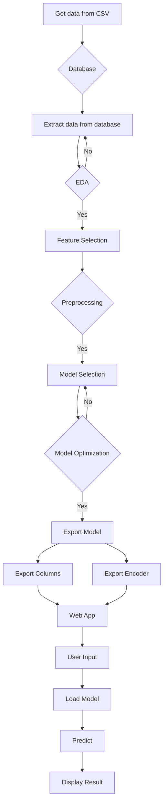
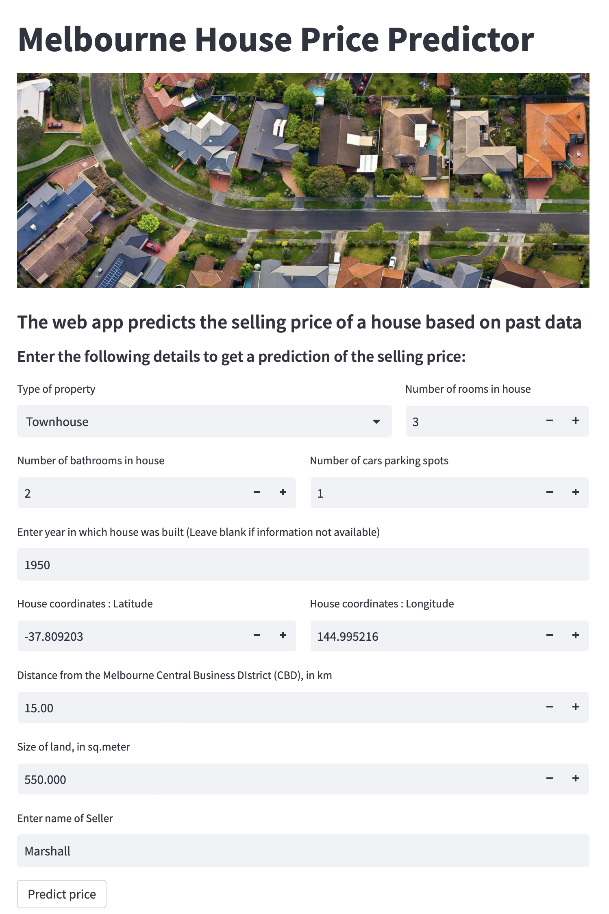
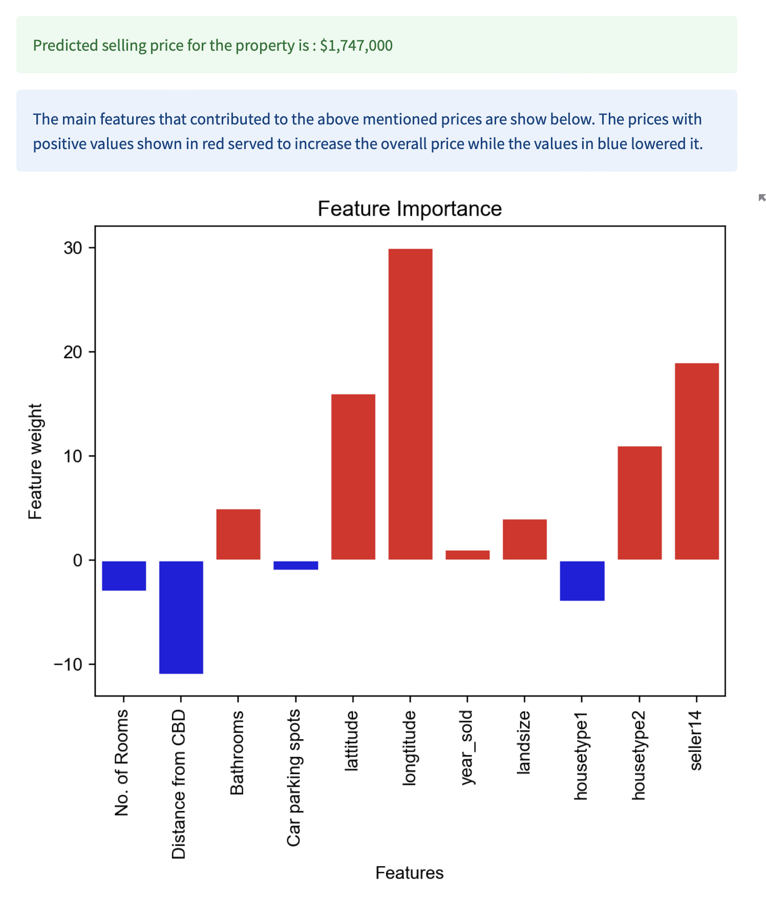

# **House Price Prediction Web App**
## **An end to end Data Science project using regression models**
---
 

### **Overview**

This project demonstrates the various stages of a real-world data science project, from data acquisition to product deployment. The process begins with the collection of data, which is then loaded into a database. The data is queried and transformed into a data frame for analysis. Exploratory Data Analysis is then performed, which reveals valuable insights about the data. These insights inform the feature selection, engineering, and transformation process, which prepares the data for model training.

The transformed data is then used to train a baseline model, from which the best model is selected. The selected model is tuned to find the optimum hyperparameters and features, ensuring the highest possible accuracy. Finally, the optimized model is used to create a web app that predicts the selling price of a house based on the selected features.

### **Contents**
- [Overview](#overview)
- [Tools and Technologies](#tools-and-technologies)
- [Folder Structure](#folder-structure)

### **Tools and Technologies**
- Programming Language: Python
- Database: PostgreSQL
- Data Injection: Psycopg2
- ORM: SQLAlchemy
- Data Analysis: Pandas, NumPy
- Data Visualization: Matplotlib, Seaborn
- Machine Learning Libraries: Scikit-learn
- Categorical data encoding: Target Encoder
- Hyperparameter tuning: GridSearchCV
- Serialization: Pickle, JSON
- Web Framework: Streamlit
- Model Interpretation: SHAP, Permuation Importance, Partail Dependence Plots

### **Folder Structure**
The project folder contains the following directories and files:

- `readme.md`: Contains the project overview and folder structure.
- `pyproject.toml`: Contains information about the project dependencies.
- `.gitignore`: Contains files and directories that are ignored by Git.
- `resources`: Contains the data, models, and other resources required for the project.
    - `webapp_screenshot1.png`: A screenshot of the web app.
    - `webapp_screenshot2.png`: Another screenshot of the web app.
    - `melb_data.csv`: Open-source data used for modeling.
    - `house_price_predictor.pickle`: A trained model for predicting house prices.
    - `target_encoder.pickle`: An encoded version of categorical features used in the model.
    - `columns.json`: A JSON file containing information about the columns used in the model.
    - `suburb.json`: A JSON file containing information about the prperty count and region for each suburb.
- `data_engineering`: Contains scripts for loading data, creating a database, and getting data from the database.
    - `createddb.sh`: A shell script to create a PostgreSQL database.
    - `db_config.py`: Generate a configuration file for the database.
    - `myd_config.ini`: Configuration file generated for the database.   
    - `getdata_from_csv.py`: A script to load data from the CSV file to a DataFrame.
    - `datainjection_todb.py`: A script to load data from the DataFrame to the database.
    - `current_folder_path.py`: A function that returns the current directory path.
    - `loaddata_fromdb.py`: A script to load data from the database to a DataFrame.
- `data_analysis`: Contains Jupyter notebooks for data exploration and analysis.
    - `EDA.ipynb`: A notebook containing exploratory data analysis.
- `modeling`: Contains Jupyter notebooks for modeling and hyperparameter tuning.
    - `modeling.ipynb`: A notebook containing data preprocessing, model selection, feature selection, and hyperparameter tuning.
- `serialization`: Contains a script to export the trained model, encoder, and column data.
    - `price_predictor.py`: A script to train the model using selected features and export it to the resources folder.
- `web_app`: Contains a script for the web app deployment.
    - `pricepredictor_webapp.py`: A script to create the web app that takes user input and displays the predicted price along with feature importance using SHAP values.
- `model_explanation`: Contains a Jupyter notebook for model explanation and interpretation.
    - `ml_explainability.ipynb`: A notebook that explores the effects of the features in the model using partial dependence plots, permutation importance, and SHAP values.

### **Flow Chart**

graph TD
A[Get data from CSV] --> B{Database};
B --> C[Extract data from database];
C --> D{EDA};
D --> |Yes| E[Feature Selection];
D --> |No| C;
E --> F{Preprocessing};
F --> |Yes| G[Model Selection];
G --> H{Model Optimization};
H --> |Yes| I[Export Model];
H --> |No| G;
I --> J[Export Columns];
I --> K[Export Encoder];
J --> L[Web App];
K --> L;
L --> M[User Input];
M --> N[Load Model];
N --> O[Predict];
O --> P[Display Result];

The goal of the project is to predict house prices in Melbourne, using machine learning algorithms and a dataset of historical house sales. The web application allows users to enter information about a house and receive a predicted sale price based on the trained model.

The project is designed to showcase an end-to-end data science project. It covers various aspects as follows:

- Data Engineering : Data collection, Data injection to a database, getting data from database to  dataframe, etc.
- Exploratory data analysis : Analyse the data and identify ay features to be removed from the data before training a model.
- Preprocessing : Remove Outliers, Feature engineering, train-test split, etc.
- Model Selection : Prepare a Baseline model and metrics to evaluate models, Model Iteration, Model Tuning, Finalize best model, features and hyeperparameters. 
- Model training and Serializaton : Use the best model and train on complete data for producton, export model to a pickle file for use in Web-App
- Web application development : Make a web app using the pickle file, that predicts the price of houses basd on user-input features and shows what features contributed to an increase or decrease in price  using shap values.
- Machine Learning Explainability : Use Perumtation Importance, Partial Depedndence Plots, and SHAP values to explain the contributio of features to the predicted price.

Here's a screenshot of the app:

 

The project demonstrates the entire data science process, from data collection to web application development, and can serve as a template for similar projects in the future.
