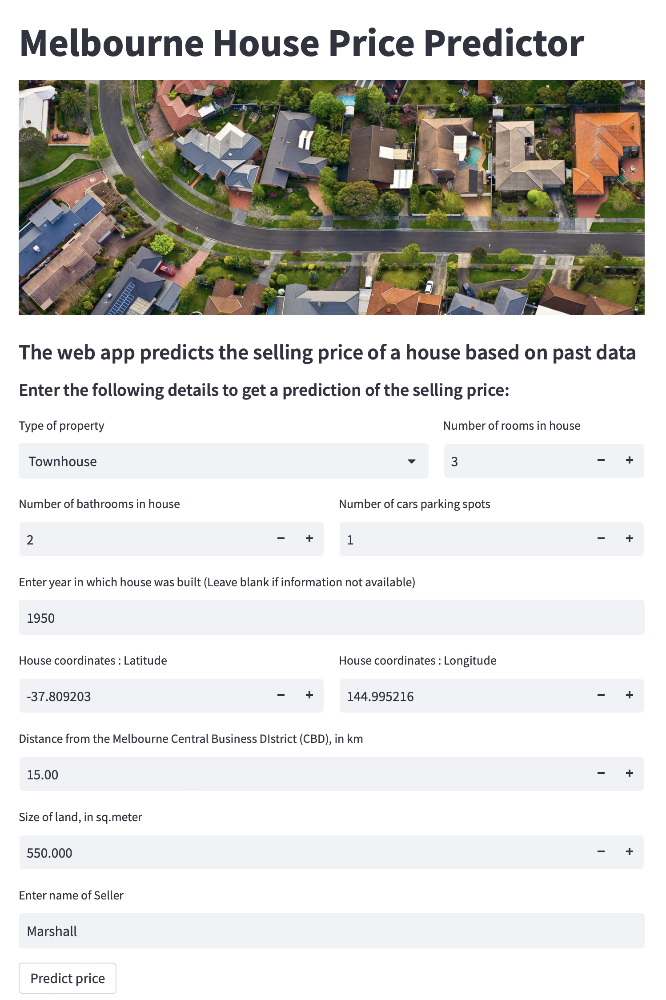
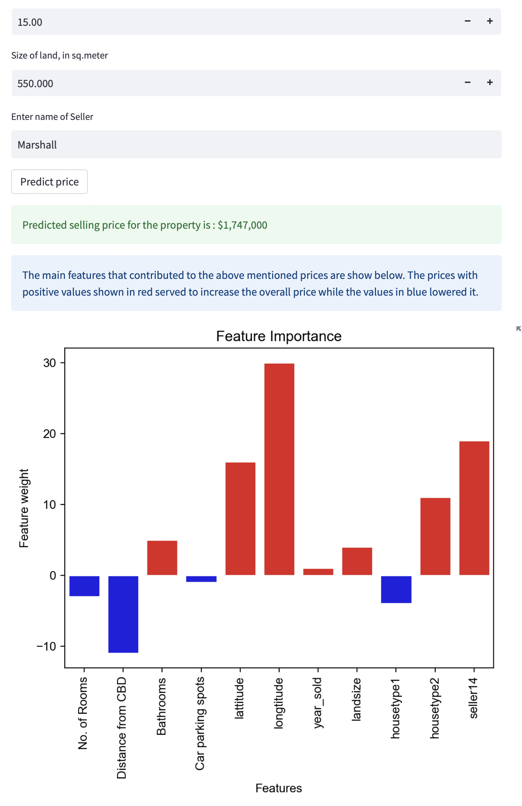

# Melbourne House Price Prediction Web App

The goal of the project is to predict house prices in Melbourne, using machine learning algorithms and a dataset of historical house sales. The web application allows users to enter information about a house and receive a predicted sale price based on the trained model.

The project is designed to showcase an end-to-end data science project. It covers various aspects as follows:

- Data Engineering : Data collection, Data injection to a database, getting data from database to  dataframe, etc.
- Exploratory data analysis : Analyse the data and identify ay features to be removed from the data before training a model.
- Preprocessing : Remove Outliers, Feature engineering, train-test split, etc.
- Model Selection : Prepare a Baseline model and metrics to evaluate models, Model Iteration, Model Tuning, Finalize best model, features and hyeperparameters. 
- Model training and Serializaton : Use the best model and train on complete data for producton, export model to a pickle file for use in Web-App
- Web application development : Make a web app using the pickle file, that predicts the price of houses basd on user-input features and shows what features contributed to an increase or decrease in price  using shap values.
- Machine Learning Explainability : Use Perumtation Importance, Partial Depedndence Plots, and SHAP values to explain the contributio of features to the predicted price.

Here's a screenshot of the app:

 

The project demonstrates the entire data science process, from data collection to web application development, and can serve as a template for similar projects in the future.
