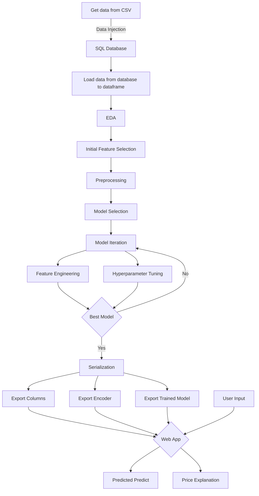
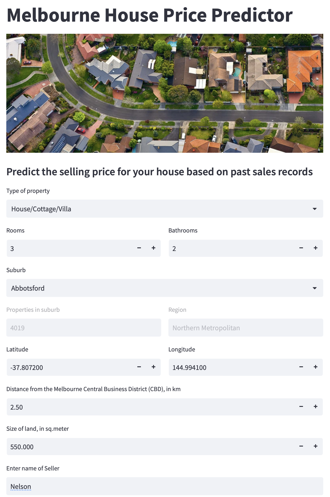
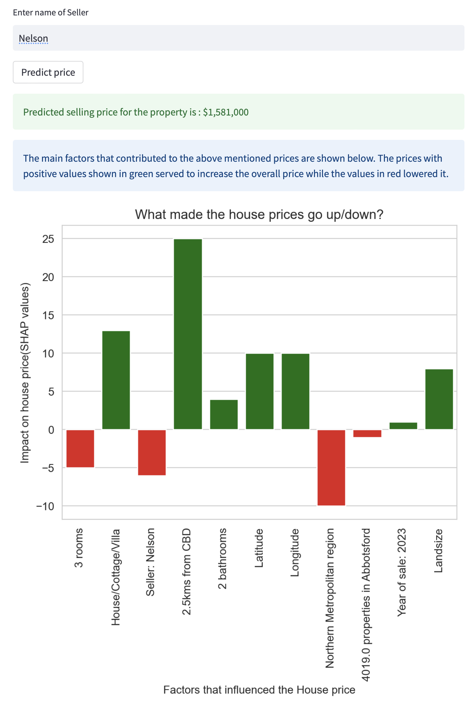

# **House Price Prediction Web App**
## **An end to end Data Science project using regression models**
---
 

### **Overview**

This project demonstrates the various stages of a real-world data science project, from data acquisition to product deployment. The process begins with the collection of data, which is then loaded into a database. The data is queried and transformed into a data frame for analysis. Exploratory Data Analysis is then performed, which reveals valuable insights about the data. These insights inform the feature selection, engineering, and transformation process, which prepares the data for model training.

The transformed data is then used to train a baseline model, from which the best model is selected. The selected model is tuned to find the optimum hyperparameters and features, ensuring the highest possible accuracy. Finally, the optimized model is used to create a web app that predicts the selling price of a house based on the selected features.

### **Contents**
- [Overview](#overview)
- [Tools and Technologies](#tools-and-technologies)
- [Folder Structure](#folder-structure)
- [Process Flow Chart](#process-flow-chart)

### **Tools and Technologies**
- Programming Language: Python
- Database: PostgreSQL
- Data Injection: Psycopg2
- ORM: SQLAlchemy
- Data Analysis: Pandas, NumPy
- Data Visualization: Matplotlib, Seaborn
- Machine Learning Libraries: Scikit-learn
- Categorical data encoding: Target Encoder
- Hyperparameter tuning: GridSearchCV
- Serialization: Pickle, JSON
- Web Framework: Streamlit
- Model Interpretation: SHAP, Permuation Importance, Partail Dependence Plots

### **Folder Structure**
The project folder contains the following directories and files:

- `readme.md`: Contains the project overview and folder structure.
- `pyproject.toml`: Contains information about the project dependencies.
- `.gitignore`: Contains files and directories that are ignored by Git.
- `resources`: Contains the data, models, and other resources required for the project.
    - `webapp_screenshot1.png`: A screenshot of the web app.
    - `webapp_screenshot2.png`: Another screenshot of the web app.
    - `melb_data.csv`: Open-source data used for modeling.
    - `house_price_predictor.pickle`: A trained model for predicting house prices.
    - `target_encoder.pickle`: An encoded version of categorical features used in the model.
    - `columns.json`: A JSON file containing information about the columns used in the model.
    - `suburb.json`: A JSON file containing information about the prperty count and region for each suburb.
- `data_engineering`: Contains scripts for loading data, creating a database, and getting data from the database.
    - `createddb.sh`: A shell script to create a PostgreSQL database.
    - `db_config.py`: Generate a configuration file for the database.
    - `myd_config.ini`: Configuration file generated for the database.   
    - `getdata_from_csv.py`: A script to load data from the CSV file to a DataFrame.
    - `datainjection_todb.py`: A script to load data from the DataFrame to the database.
    - `current_folder_path.py`: A function that returns the current directory path.
    - `loaddata_fromdb.py`: A script to load data from the database to a DataFrame.
- `data_analysis`: Contains Jupyter notebooks for data exploration and analysis.
    - `EDA.ipynb`: A notebook containing exploratory data analysis.
- `modeling`: Contains Jupyter notebooks for modeling and hyperparameter tuning.
    - `modeling.ipynb`: A notebook containing data preprocessing, model selection, feature selection, and hyperparameter tuning.
- `serialization`: Contains a script to export the trained model, encoder, and column data.
    - `price_predictor.py`: A script to train the model using selected features and export it to the resources folder.
- `web_app`: Contains a script for the web app deployment.
    - `pricepredictor_webapp.py`: A script to create the web app that takes user input and displays the predicted price along with feature importance using SHAP values.
- `model_explanation`: Contains a Jupyter notebook for model explanation and interpretation.
    - `ml_explainability.ipynb`: A notebook that explores the effects of the features in the model using partial dependence plots, permutation importance, and SHAP values.

### **Process Flow Chart**

### **Data Engineering**
The historical data on sales prices for houses in Melbourne[1](#ref1) was collected as a csv file and and injected into PostgreSQL database using Psycopg2. This has the following advantages:
1. **Performance**: SQL databases are optimized for handling large amounts of structured data. Querying from a database is faster when the data is large.
2. **Data integrity**: SQL databases have built-in mechanisms for ensuring data integrity, such as constraints, indexes, and transactions. These mechanisms can help prevent data errors and inconsistencies, which can be difficult to detect and correct in a large DataFrame.
3. **Scalability**: SQL databases can handle large datasets that may not fit into memory, and can also be scaled up by adding more computing resources or partitioning data across multiple servers. 
4. **Security**: SQL databases offer advanced security features, such as user authentication and access control, to protect sensitive data.
5. **Collaboration**: By storing data in a centralized SQL database, multiple users can access and query the same dataset concurrently.

A script that loads the queried data into a Pandas dataframe using SQLAlchemy has also been created. This script is used for the remaining prcoesses, when the data is required.

### **Data Analysis**
Exploratory Data Analysis(EDA) was conducted on the data to gather insights from the data. Viuslaizations were created using matplotlib and seaborn to get a deeper understanding of the data. This aided in identifying outliers, understanding correlations, exploring fetaure engineering possibilities, and in indentifying features that might be better dropped due to being redundant or providing little to know value.

### **Modeling**
#### **Preprocessing**
The insights gathere from EDA enabled us to perform an initial feature selection and feature engineering. The data was then split into a **training set** and **test set**. 
Examples of feature engineering done are:
1. The natural log of the landsize was observed to show a higher correlation with price and was used to replace the landsize feature.
2. The categorical features were encoded with One-Hot Encoding and Target encoding. Target encoding proved to be the better option and was therefore employed in the final model.

#### **Model Selection**
The training and test set was used to evaluate the performance of the following supervised learning models from Scikit-Learn:
1. **Liner Regression**
2. **Decsion Tree Regressor**
3. **Random Forest Regressor**

Random Forest Regressor proved to be the better choice for the data as it had the lowest **Mean Absolute Error(MAE)** and the highest **R2 Score**.

#### **Model Iteration**
The Random Forest Regressor was then used to evalaute various combinations of features using 5 fold **cross-validation**. This aided in **Feature Selection** to get the best predictions and also to decide what inputs would be required from a user to predict a house's price.
The selected features were:
1. The number of rooms
2. The number of bathrooms
3. The type of property (House/Cottage/Villa, Townhouse, Unit/Duplex, or other)
4. The person who sold the house
5. The coordinates of the house (Latitude and Logitude)
6. The region where the house is located
7. The number of properties in the suburb
8. The year of sale
9. Natural log of the landsize
10. Distance of the property from the Central Business District (CBD)

Once the features that aided in getting the best prediction scores were identified, **Hyperparameter Tuning** was done to identify the parameter that gave the best score in Cross-Validation using **GridSearchCV**. The features and hyperparemeters were also tested for **Overfitting** using the test set.

The optimum hyperparemeters for the Random Forest Regressor identified were:
* `n_estimators=450`
* `max_features=4`

### **Serialization**
The entire process of feature selection, feature engineering and model training was carried out on the entire data in a `price_predictor.py` script for production. The script also exported the following to the resouces folder for access by the web app:
1. The trained model (`pickle` file)
2. The fitted target encoder (`pickle` file)
3. The names of features used to train the model (`JSON` file)
4. The Number of properties in each suburb along with the region where each suburb falls (`JSON` file)

### **Web App**
The front end of the web app is designed using `streamlit`. The User Interface is kept minimalistic and takes in the following details from the user as Input:
1. Type of property
2. Rooms 
3. Bathrooms 
4. Suburb
5. Coordinates of property
6. Distance from CBD
7. Size of land, and
8. Name of Seller

Upon entering the details and clicking the **Predict** button, the script does the following:
1. It uses the imported Suburbs data to check the Property count and Region corresponding to the Suburb.
2. It uses the imported target encoder to transform the type, region and seller name to a numerical value for use by the ML model.
3. It uses the imported column names to create an observations pertaining to the user's house.
4. It uses the imported trained model to predict the selling price for the property with **78% accuracy** as observed with R2 score.
5. It calculates the **SHAP values** for the observation and displays a bar chart that shows the contribution that each feature had, in raising or lowering the price of the house.

#### **Web App Screenshots**
 

### **Model Explanation**
A Jupyter notebook was used to explain the importance of the features from the data in making predictions. Three tools were used for this purpose, namely, `Permutation Importance`, `Partial Dependence Plots`, and `SHAP` Values (an acronym from SHapley Additive exPlanations).

1. **Permutation Importance** - Shows us what features most affect predictions.
<iframe src="./house_price_predictor/resources/weights.html" width="50%"></iframe>

2. **Partial Dependence Plots** - Shows us how a feature affects predictions.
3. **SHAP Values** - SHows us the impact of each feature for a particular prediction.

Note: These tools are used after a model has been fit.

### **References**
1. : https://www.kaggle.com/datasets/dansbecker/melbourne-housing-snapshot Melbourne housing prices snapshot from Kaggle